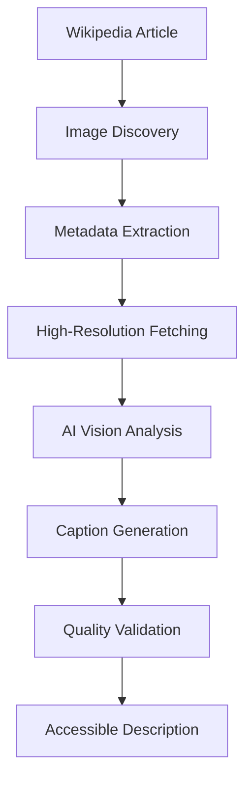

# AI-Powered Image Captioning

Chakshu's image captioning system uses advanced computer vision to generate detailed, accessibility-focused descriptions of images found in Wikipedia articles. This feature is powered by the Qwen2.5-VL vision-language model running through Ollama.

## Overview

The image captioning system transforms visual content into comprehensive text descriptions that help visually impaired users understand the visual elements of Wikipedia articles.

### Key Features

- **Context-Aware Descriptions**: Uses article context and existing metadata
- **Detailed Visual Analysis**: Comprehensive descriptions of visual elements
- **Accessibility Optimization**: Language optimized for screen readers
- **High-Resolution Processing**: Analyzes the highest quality images available
- **Parallel Processing**: Multiple images processed simultaneously for performance

## How It Works

### Processing Pipeline



### 1. Image Discovery

The system scans Wikipedia articles to find all images:

```python
# Extract images from Wikipedia API
api_url = f"https://en.wikipedia.org/w/api.php?action=query&prop=images&format=json&titles={page_title}"
response = _fetch_api(api_url)
images_to_process = []
for page_data in response.get("query", {}).get("pages", {}).values():
    images_to_process.extend(page_data.get("images", []))
```

**Image Types Processed**:
- Photographs and illustrations
- Diagrams and charts
- Maps and geographical images
- Historical documents and artifacts
- Scientific and technical imagery

**Excluded Content**:
- SVG files (not supported by vision model)
- Decorative elements and icons
- Navigation images
- Very small thumbnails

### 2. Metadata Extraction

The system gathers existing context about each image:

```python
# Fetch image metadata from Wikipedia
metadata_response = _fetch_api(api_url)
metadata = page["imageinfo"][0].get("extmetadata", {})

title_caption = clean_html(metadata.get("ImageDescription", {}).get("value"))
description = clean_html(metadata.get("ObjectName", {}).get("value"))
```

**Metadata Sources**:
- **ImageDescription**: Original image caption
- **ObjectName**: Image title or subject
- **Artist**: Creator information
- **DateTimeOriginal**: When the image was created
- **Categories**: Image classification tags

### 3. High-Resolution Processing

The system fetches the highest quality version of each image:

```python
def get_high_resolution_image_url(image_title):
    commons_api = "https://commons.wikimedia.org/w/api.php"
    params = {
        "action": "query",
        "titles": image_title,
        "prop": "imageinfo",
        "iiprop": "url",
        "iiurlwidth": 4000,  # Request high resolution
        "format": "json",
    }
```

**Quality Benefits**:
- Better detail recognition
- More accurate object identification
- Improved text reading in images
- Enhanced spatial relationship understanding

### 4. AI Vision Analysis

The core of the system uses Qwen2.5-VL for image analysis:

#### Model Specifications

**Qwen2.5-VL Model**:
- **Architecture**: Vision-Language Transformer
- **Capabilities**: Image understanding, text generation, spatial reasoning
- **Strengths**: Detailed descriptions, context awareness, multilingual support
- **Optimization**: Fine-tuned for accessibility descriptions

#### Prompt Engineering

The system uses a carefully crafted prompt to generate accessibility-focused descriptions:

```python
IMAGE_CAPTIONING_PROMPT = """
[User]: Forget all previous messages and context. Focus **only** on the provided image.

You are an AI specialized in generating **highly descriptive yet concise captions** for images,
designed to help **visually impaired individuals** understand the scene with clarity.

### **Key Instructions:**
1. **Use Provided Context for Identification (If Certain):**
   - If the **Title, Caption, or Description** mentions a **specific person, object, or place**, use the name **instead of generic terms**.
   - If uncertain, describe the object or person as seen without assumption.
2. **Describe Actions and Positions Clearly:**
   - Identify what each person is doing.
   - Specify relative positioning (who is sitting, standing, or interacting how).
3. **Include Background Elements Only If Relevant:**
   - Mention key visible details but avoid adding details that are not evident.
4. **Concise Yet Detailed:** Use structured, vivid descriptions while keeping it short and natural.

### **Context Provided (Use Only If It Matches What Is Seen):**
- **Title:** {Title}
- **Caption:** {Caption}
- **Description:** {Description}

### **Your Task:**
Generate a **short but structured paragraph** that accurately describes:
- **The main subjects and their actions.**
- **Their spatial arrangement (who is sitting, standing, or interacting how).**
- **Any relevant background elements.**
- **Ensure clarity while keeping it brief.**
"""
```

#### API Integration

The system communicates with Ollama through a FastAPI wrapper:

```python
def generate_image_caption(image_url, title, caption, description):
    prompt = IMAGE_CAPTIONING_PROMPT.format(
        Title=title, 
        Caption=caption, 
        Description=description
    )
    payload = {"prompt": prompt, "image_url": image_url}
    
    service_url = get_env_variable("OLLAMA_BASE_URL") + "/query"
    response = requests.post(service_url, json=payload, timeout=90)
    
    return response.json().get("response")
```

### 5. Quality Validation

The system includes multiple quality checks:

**Technical Validation**:
- Response completeness check
- Minimum description length
- Proper sentence structure
- No placeholder text

**Content Validation**:
- Relevance to image content
- Appropriate level of detail
- Accessibility language standards
- Context consistency

## Caption Quality Features

### Accessibility-Focused Language

**Spatial Descriptions**:
```
"The image shows Daniel Craig, dressed in a dark suit and tie, standing on a red carpet at the Berlin premiere of 'Spectre.' He is positioned in the foreground, facing slightly to the left, with a backdrop featuring the event's branding."
```

**Key Elements**:
- **Subject Identification**: "Daniel Craig"
- **Appearance Details**: "dressed in a dark suit and tie"
- **Spatial Position**: "positioned in the foreground, facing slightly to the left"
- **Context Information**: "red carpet at the Berlin premiere of 'Spectre'"
- **Background Details**: "backdrop featuring the event's branding"

### Detailed Visual Analysis

**Comprehensive Descriptions**:
```
"The image showcases a classic Aston Martin DB5, a sleek silver sports car, parked on a paved area. The car's polished chrome grille and round headlights are prominently visible, reflecting its iconic design. In the background, other cars and greenery are faintly visible, suggesting a parking lot or a similar outdoor setting."
```

**Description Components**:
- **Object Identification**: "classic Aston Martin DB5"
- **Visual Characteristics**: "sleek silver sports car"
- **Specific Details**: "polished chrome grille and round headlights"
- **Design Elements**: "reflecting its iconic design"
- **Environmental Context**: "parking lot or similar outdoor setting"

### Context Integration

The system intelligently uses available context:

**With Context**:
- Article about "James Bond" + Image of car = "Aston Martin DB5 (James Bond's iconic car)"
- Article about "Italy" + Image of building = "Italian architecture" or specific landmark

**Without Context**:
- Generic descriptions based purely on visual analysis
- Focus on observable elements and characteristics

## Performance Optimization

### Parallel Processing

Multiple images are processed simultaneously:

```python
processed_results = Parallel(n_jobs=-1, backend="threading")(
    delayed(_process_single_image)(img, all_captions) 
    for img in images_to_process
)
```

**Benefits**:
- Faster overall processing time
- Better resource utilization
- Improved user experience

### Caching Strategy

**Cache Levels**:
1. **Database Cache**: Permanent storage of generated captions
2. **Memory Cache**: Fast access to recently processed images
3. **CDN Cache**: Global distribution of processed results

**Cache Keys**:
```python
cache_key = f"image_caption:{image_url_hash}:{model_version}"
```

### Error Handling

**Graceful Degradation**:
```python
def _process_single_image(img_info, all_captions):
    try:
        # Full processing pipeline
        return process_image_with_ai(img_info)
    except ServiceUnavailableError:
        # Fallback to existing caption
        return use_existing_caption(img_info)
    except Exception as e:
        # Log error and skip image
        logger.error(f"Failed to process image: {e}")
        return None
```

## Integration Examples

### API Usage

**Request**:
```bash
curl "http://localhost:8000/api/process/?link=https://en.wikipedia.org/wiki/James_Bond&option=4"
```

**Response**:
```json
{
  "status": "success",
  "type": "image_captions",
  "content": [
    {
      "image_url": "https://upload.wikimedia.org/wikipedia/commons/d/d3/Aston.db5.coupe.300pix.jpg",
      "final_caption": "The image showcases a classic Aston Martin DB5..."
    }
  ],
  "image_count": 7
}
```

### Client Integration

**JavaScript Example**:
```javascript
async function getImageCaptions(articleUrl) {
  try {
    const response = await fetch(`/api/process/?link=${encodeURIComponent(articleUrl)}&option=4`);
    const data = await response.json();
    
    if (data.status === 'success') {
      data.content.forEach((image, index) => {
        console.log(`Image ${index + 1}:`);
        console.log(`URL: ${image.image_url}`);
        console.log(`Description: ${image.final_caption}`);
        console.log('---');
      });
    }
  } catch (error) {
    console.error('Failed to get image captions:', error);
  }
}
```

### Screen Reader Integration

**ARIA Labels**:
```html

<div id="chakshu-caption-1" class="sr-only">
  The image showcases a classic Aston Martin DB5, a sleek silver sports car...
</div>
```

## Configuration

### Environment Variables

```env
# Ollama service configuration
OLLAMA_BASE_URL=http://localhost:11434
MODEL_NAME=qwen2.5vl

# Processing settings
IMAGE_PROCESSING_TIMEOUT=90
MAX_CONCURRENT_IMAGES=5
CACHE_TIMEOUT_SECONDS=3600

# Quality settings
MIN_CAPTION_LENGTH=50
MAX_CAPTION_LENGTH=500
```

### Model Configuration

**Ollama Setup**:
```bash
# Install Ollama
curl -fsSL https://ollama.ai/install.sh | sh

# Pull the Qwen2.5-VL model
ollama pull qwen2.5vl

# Start Ollama service
ollama serve
```

## Troubleshooting

### Common Issues

**Model Not Available**:
```bash
# Check if model is installed
ollama list

# Pull model if missing
ollama pull qwen2.5vl
```

**Service Connection Issues**:
```bash
# Check Ollama service status
curl http://localhost:11434/api/tags

# Restart Ollama if needed
ollama serve
```

**Performance Issues**:
- Reduce concurrent processing: `MAX_CONCURRENT_IMAGES=3`
- Increase timeout: `IMAGE_PROCESSING_TIMEOUT=120`
- Check system resources (RAM, GPU usage)

### Error Messages

**"Failed to connect to external services"**:
- Ollama service is not running
- Network connectivity issues
- Firewall blocking connections

**"Image processing timed out"**:
- Increase timeout settings
- Check system performance
- Reduce concurrent processing

**"No processable images found"**:
- Article contains only SVG images
- Images are too small or low quality
- Network issues fetching images

## Future Enhancements

### Planned Improvements

**Enhanced AI Capabilities**:
- Multi-language caption generation
- Specialized models for different image types
- Real-time caption updates
- Interactive image exploration

**Performance Optimizations**:
- GPU acceleration support
- Edge computing deployment
- Predictive image processing
- Adaptive quality settings

**Accessibility Features**:
- Customizable description detail levels
- Voice-optimized descriptions
- Braille-friendly formatting
- Integration with assistive technologies

### Community Contributions

**Open Source Development**:
- Model fine-tuning for accessibility
- Multi-language support
- Platform-specific optimizations
- Quality improvement feedback

## Next Steps

- **[Table Analysis](table_analysis.md)** - Learn about table processing capabilities
- **[Mathematical Content](mathematical_content.md)** - LaTeX and formula conversion
- **[API Documentation](../api/processing_api.md)** - Technical API reference
- **[Architecture](../architecture/ai_integration.md)** - AI system architecture details