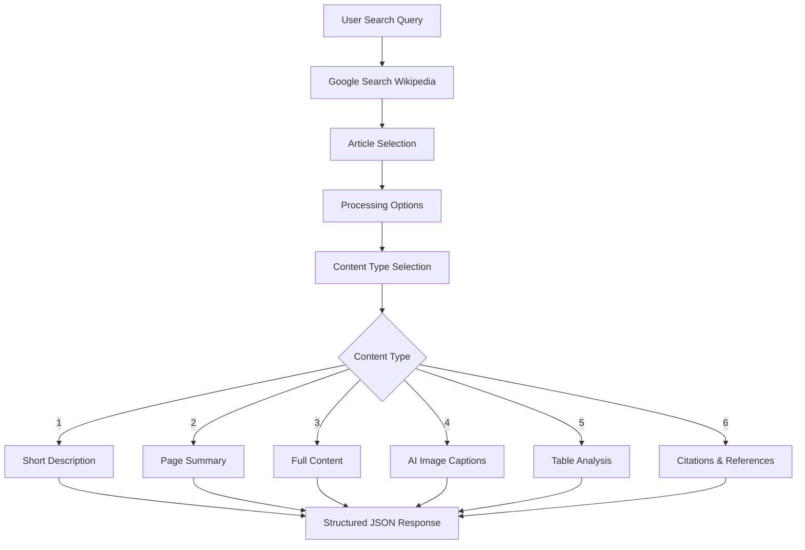

# Project Overview

## Mission Statement

**Chakshu** is dedicated to making Wikipedia accessible to blind and visually impaired users by transforming complex web content into structured, screen-reader-friendly formats through advanced AI and accessibility-focused design.

## The Problem We Solve

Wikipedia contains vast amounts of human knowledge, but much of it remains inaccessible to visually impaired users due to:

- **Complex visual layouts** with tables, images, and mathematical content
- **Unstructured content** that's difficult for screen readers to navigate
- **Visual elements** like charts, diagrams, and images without proper descriptions
- **Mathematical equations** in LaTeX format that can't be read by text-to-speech systems

## Our Solution

Chakshu addresses these challenges through:

### 🎯 **Accessibility-First Design**
Every feature is designed with screen readers and text-to-speech systems in mind, ensuring content is properly structured and navigable.

### 🤖 **Advanced AI Integration**
- **Qwen2.5-VL vision model** for detailed image descriptions
- **Playwright-based table capture** for complex data visualization
- **LaTeX-to-text conversion** for mathematical content
- **Chemical notation processing** for scientific articles

### 🔄 **Intelligent Content Processing**
- Structured content extraction with proper heading hierarchy
- Parallel processing for performance optimization
- Smart caching to reduce load times
- Error handling and graceful fallbacks

## Core Workflow

## Technology Stack

### **Backend Framework**
- **Django 5.1** - Robust web framework with excellent accessibility support
- **Django REST Framework** - API development with proper serialization
- **Gunicorn** - Production WSGI server

### **AI & Machine Learning**
- **Ollama** - Local AI model serving platform
- **Qwen2.5-VL** - State-of-the-art vision-language model
- **Transformers** - Hugging Face model integration
- **PyTorch** - Deep learning framework

### **Content Processing**
- **BeautifulSoup** - HTML parsing and content extraction
- **Playwright** - Browser automation for table screenshots
- **Joblib** - Parallel processing for performance
- **Wikipedia API** - Structured data access

### **Infrastructure**
- **Docker** - Containerized deployment
- **Poetry** - Dependency management
- **Redis** - Production caching (optional)
- **PostgreSQL** - Production database support

## Target Users

### **Primary Users**
- **Blind and visually impaired individuals** seeking accessible Wikipedia content
- **Screen reader users** requiring properly structured content
- **Students and researchers** with visual impairments

### **Secondary Users**
- **Accessibility developers** building inclusive applications
- **Educational institutions** creating accessible learning materials
- **Assistive technology providers** integrating Wikipedia access

## Key Differentiators

### **Comprehensive Accessibility**
Unlike generic web scrapers, Chakshu is purpose-built for accessibility with features like:
- Structured heading hierarchy
- Detailed image descriptions
- Table-to-text conversion
- Mathematical content processing

### **Advanced AI Integration**
Leverages cutting-edge vision models to provide context-aware image descriptions that go beyond simple alt-text.

### **Performance Optimized**
- Parallel processing for multiple content types
- Intelligent caching strategies
- Efficient database queries
- Graceful error handling

### **Production Ready**
- Comprehensive logging and monitoring
- Docker containerization
- Environment-based configuration
- Security best practices

## Impact & Vision

### **Immediate Impact**
- Provides immediate access to Wikipedia's vast knowledge base for visually impaired users
- Reduces barriers to information access in education and research
- Demonstrates best practices for accessible web application development

### **Long-term Vision**
- Expand to other knowledge sources beyond Wikipedia
- Integrate with voice assistants and smart speakers
- Develop mobile applications for on-the-go access
- Create educational partnerships with institutions serving visually impaired students

## Open Source Commitment

Chakshu is committed to open source development because:
- **Accessibility should be free** and available to everyone
- **Community contributions** improve the platform for all users
- **Transparency** builds trust in accessibility tools
- **Educational value** helps developers learn accessibility best practices

Join us in making the web more accessible for everyone.